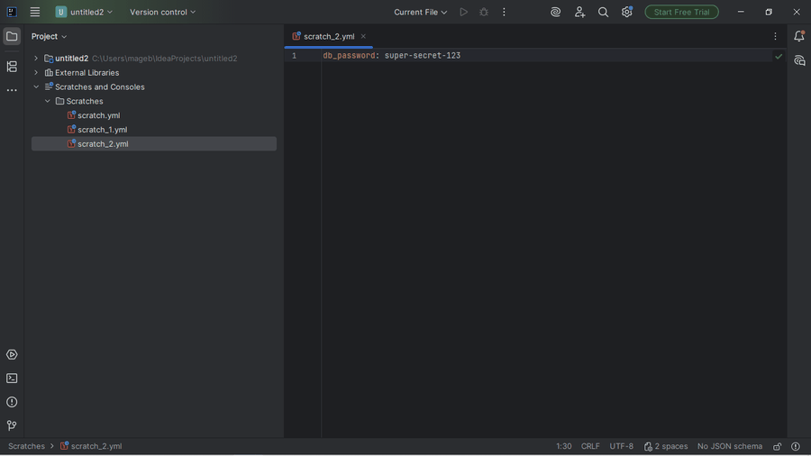

# Ansible Companion

IntelliJ/PyCharm plugin. **Encrypt and decrypt Ansible Vault (1.1/AES256
format) directly in the editor**, without depending on `ansible-vault`
being installed.

## Why it exists

Born from real evidence in JetBrains Marketplace reviews, not assumptions:
this niche's incumbents (paid and free) have concrete, repeated complaints
about price, YAML they shouldn't touch, and badly parsed Jinja2. Vault
encrypt/decrypt in particular is one of the features users value most in
the paid incumbent — and one of the few pieces that can be built without
depending on an external language server.

## Why reimplemented, not the `ansible-vault` CLI

Ansible **does not run on native Windows** (`ansible-core` fails to import
`fcntl`/`os.get_blocking`, both POSIX-only) — and a good share of this
plugin's real users are on Windows precisely because that's why they need
IntelliJ/PyCharm to edit Ansible in the first place, not a Linux VM with
vim. Asking them to install `ansible-vault` as a prerequisite isn't a way
out.

`AnsibleVaultCipher` reimplements the 1.1/AES256 format with the JDK's own
`javax.crypto` — zero new dependencies. Verified against the real test
vector from `ansible/ansible`'s own test suite
(`test/units/parsing/vault/test_vault.py`) and against a real platform test
(`BasePlatformTestCase`) that confirms the encrypt→decrypt round-trip on a
real editor.

## Usage



Select text in the editor → right-click:
- **Encrypt Selection as Ansible Vault** — asks for a password, replaces
  the selection with a `$ANSIBLE_VAULT;1.1;AES256` block.
- **Decrypt Ansible Vault Selection** — on an already-encrypted block, asks
  for the password and replaces it with the plain text.

The password is never saved or cached between uses.

## Ansible Companion Pro

- FQCN-aware completion — `ansible.builtin.*` (69 modules),
  `community.general.*` (566 modules), and `ansible.posix.*` (14
  modules), 649 total.
- Jinja2 (`{{ }}`/``/`{# #}`) syntax highlighting inside Ansible
  YAML.
- Ctrl+Click / Ctrl+B navigation from a role reference (`roles:` list
  entry, or `include_role`/`import_role`'s `name:`) to that role's
  `tasks/main.yml`.
- **Security hygiene checks** — static, no `ansible-lint`/`ansible-core`
  binary required (works natively on Windows). Three checks in this
  first release:
  - A task sets a password-shaped argument (`user.password`,
    `mysql_user.password`, `uri.password`, etc.) without `no_log` —
    the value can end up in console/CI logs (CVE-2021-20191).
  - `include_vars` loads a file whose name looks vault/secret-shaped
    (contains `vault` or `secret`) without `no_log` (CVE-2024-8775).
  - `validate_certs: false`/`no` hardcoded on a task.

  `no_log` set on an enclosing `block:`/`rescue:`/`always:` protects
  the tasks inside it, same as real Ansible. Known limitations, by
  design: the vault/secret check is a filename heuristic (a
  differently-named vault file won't be flagged), and inheritance is
  only resolved within the same file — a play-level or role-level
  `no_log` won't be picked up. Only the `no_log`+password check maps
  to an actual `ansible-lint` rule tag (`security`); the rest live in
  its `safety` profile or are this plugin's own addition
  (`validate_certs`) — this isn't a reimplementation of
  `ansible-lint`.

All available as an optional paid tier (file-type detection that
doesn't hijack Kubernetes/Helm/Docker-compose YAML — the free tier's
own detection already covers that). Vault encrypt/decrypt above stays
free forever.

### Enterprise / Team Licensing

Need volume licensing for your team, custom detection rules, or
priority support? Contact us at **gaphunterlabs@gmail.com**.

Multi-environment variable preview isn't built yet.

## Development

```
./gradlew test           # unit + platform tests
./gradlew buildPlugin     # generates build/distributions/*.zip
./gradlew verifyPlugin    # checks compatibility against real IDEs
```

`runIde` (spins up a full IntelliJ instance) is reserved for occasional
verification, not the everyday loop — to test editor actions, a platform
test (`BasePlatformTestCase`, see
`src/test/kotlin/.../vault/VaultEditorOpsTest.kt`) is faster and doesn't
depend on mouse clicks.

## License

Apache-2.0. See `LICENSE`.
