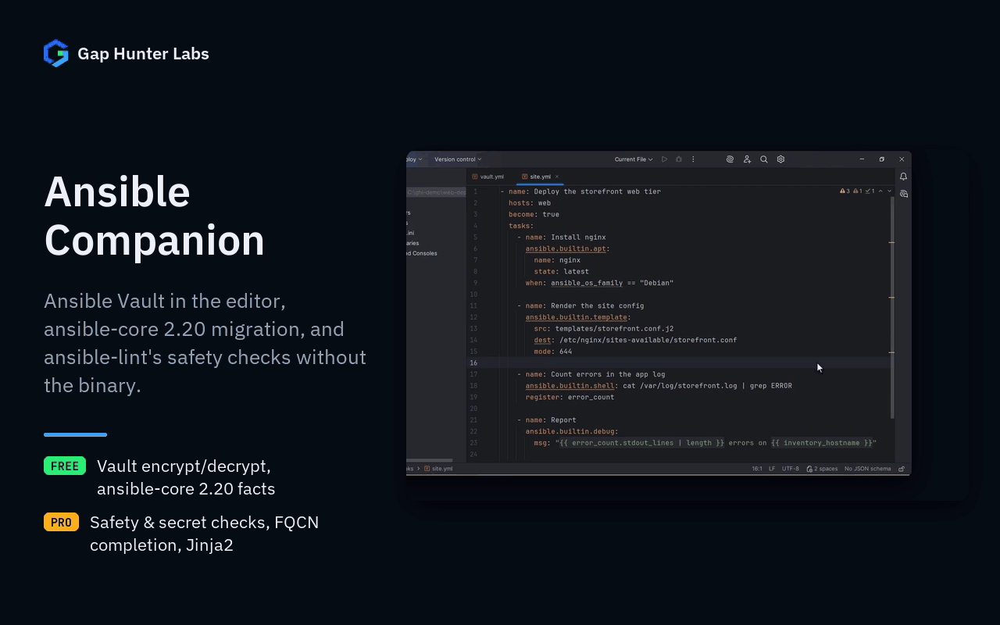
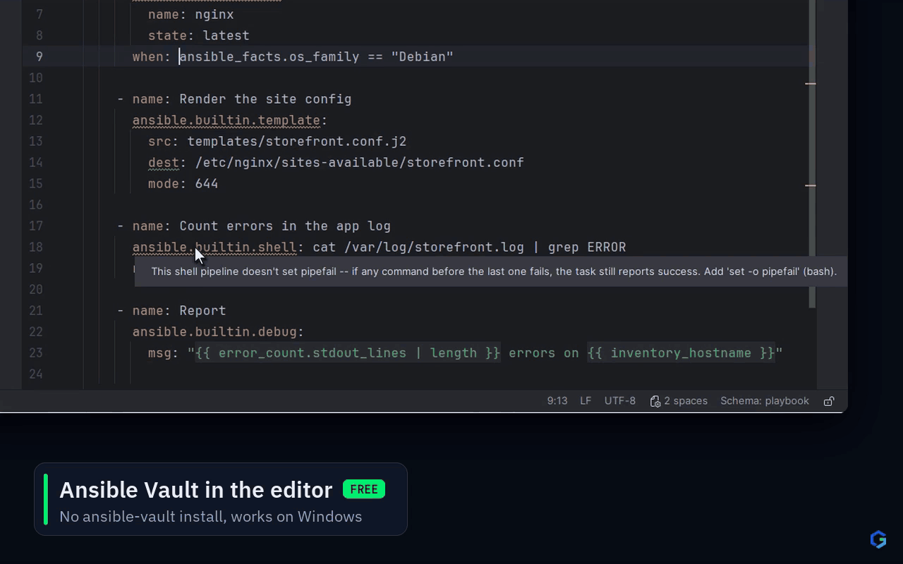

# Ansible Companion

IntelliJ/PyCharm plugin. **Encrypt and decrypt Ansible Vault (1.1/AES256
format) directly in the editor**, without depending on `ansible-vault`
being installed.



Each feature on its own:
[ansible-core 2.20 migration](docs/media/01-facts-migration.gif) ·
[Safety checks](docs/media/02-safety-checks.gif) ·
[Ansible Vault in the editor](docs/media/03-vault.gif)

## Why it exists

Born from real evidence in JetBrains Marketplace reviews, not assumptions:
this niche's incumbents (paid and free) have concrete, repeated complaints
about price, YAML they shouldn't touch, and badly parsed Jinja2. Vault
encrypt/decrypt in particular is one of the features users value most in
the paid incumbent — and one of the few pieces that can be built without
depending on an external language server.

## Why reimplemented, not the `ansible-vault` CLI

Ansible **does not run on native Windows** (`ansible-core` fails to import
`fcntl`/`os.get_blocking`, both POSIX-only) — and a good share of this
plugin's real users are on Windows precisely because that's why they need
IntelliJ/PyCharm to edit Ansible in the first place, not a Linux VM with
vim. Asking them to install `ansible-vault` as a prerequisite isn't a way
out.

`AnsibleVaultCipher` reimplements the 1.1/AES256 format with the JDK's own
`javax.crypto` — zero new dependencies. Verified against the real test
vector from `ansible/ansible`'s own test suite
(`test/units/parsing/vault/test_vault.py`) and against a real platform test
(`BasePlatformTestCase`) that confirms the encrypt→decrypt round-trip on a
real editor.

## Usage



Select text in the editor → right-click:
- **Encrypt Selection as Ansible Vault** — asks for a password, replaces
  the selection with a `$ANSIBLE_VAULT;1.1;AES256` block.
- **Decrypt Ansible Vault Selection** — on an already-encrypted block, asks
  for the password and replaces it with the plain text.

The password is never saved or cached between uses.

### Migrating to ansible-core 2.20 (free)

ansible-core 2.20 deprecates injecting gathered facts as top-level
variables: `ansible_os_family`, `ansible_distribution`,
`ansible_default_ipv4` and the rest still work in 2.20, but
`INJECT_FACTS_AS_VARS` becomes `False` in 2.24 and only
`ansible_facts['os_family']` keeps working. Every such use in an Ansible
playbook, role or variables file gets a weak warning with a quick fix
(`ansible_os_family` -> `ansible_facts.os_family`, valid in every
supported version; **Fix all in file** rewrites the whole file).

Checked inside `{{ }}`/`` and in the value of `when`, `failed_when`,
`changed_when`, `until` and `that`. Only names that are gathered facts are
reported — connection settings and magic variables (`ansible_host`,
`ansible_user`, `ansible_python_interpreter`, `ansible_check_mode`,
`ansible_play_hosts`, ...) keep working and are never touched. Text inside
a quoted string in an expression and variables reached through another
object (`hostvars[h].ansible_os_family`) are left alone. It's an ordinary
inspection (Settings -> Editor -> Inspections -> Ansible), so it can be
turned off or given another severity.

## Ansible Companion Pro

- FQCN-aware completion — `ansible.builtin.*` (69 modules),
  `community.general.*` (566 modules), and `ansible.posix.*` (14
  modules), 649 total.
- Jinja2 (`{{ }}`/``/`{# #}`) syntax highlighting inside Ansible
  YAML.
- Ctrl+Click / Ctrl+B navigation from a role reference (`roles:` list
  entry, or `include_role`/`import_role`'s `name:`) to that role's
  `tasks/main.yml`.
- **Security hygiene checks** — static, no `ansible-lint`/`ansible-core`
  binary required (works natively on Windows).

  Package, checkout and content safety:
  - A package manager task (`apt`, `dnf`, `yum`, `package`, `pip`, `npm`,
    ...) with `state: latest` — it upgrades on every run, so the play's
    result depends on when it runs. Allowed with `update_only: true`
    (dnf/yum) or `only_upgrade: true` (apt).
  - A `git` task with `version: HEAD` (or `hg` with `revision: tip`) —
    two runs can deploy different code; pin a tag or a commit.
  - `copy` with a dict or list as `content` — written out through an
    undocumented implicit conversion; convert it explicitly
    (`content: "{{ value | to_json }}"`).

  Secret exposure:
  - A task sets a password-shaped argument (`user.password`,
    `mysql_user.password`, `uri.password`, etc.) without `no_log` —
    the value can end up in console/CI logs (CVE-2021-20191).
  - `include_vars` loads a file whose name looks vault/secret-shaped
    (contains `vault` or `secret`) without `no_log` — including the
    free-form style `include_vars: secrets/prod.vault.yml`
    (CVE-2024-8775).
  - `validate_certs: false`/`no` hardcoded on a task.

  File and shell hygiene:
  - A module that creates a file or directory (`copy`, `template`,
    `file` with `state: directory`/`touch`, `get_url`, `assemble`,
    `archive`, and `lineinfile`/`blockinfile`/`ini_file`/`htpasswd`
    when they'll create the file) without an explicit `mode` — the
    result depends on the remote host's umask. Not flagged for
    `state: absent`/`link`/`hard`, `recurse`, or `file` with its
    default state (which only modifies an existing path).
  - An unquoted `mode: 755` — YAML reads it as the decimal number 755,
    which sets permissions 01363, not 0755. Only reported when the
    resulting permissions are actually nonsensical (`mode: 420` is
    exactly 0644 and isn't flagged); quoted and leading-zero values
    never are.
  - A `shell` pipeline without `set -o pipefail` — if any command
    before the last one fails, the task still reports success. `||`,
    Jinja filters (`{{ x | default('y') }}`), and a `|` inside quotes
    (`grep -E 'a|b'`) aren't treated as pipes; `command` tasks and
    tasks with `ignore_errors` aren't checked.

  `no_log` set on an enclosing `block:`/`rescue:`/`always:` protects
  the tasks inside it, same as real Ansible. Arguments given through a
  task's `args:` are read too. Known limitations, by design: the
  vault/secret check is a filename heuristic (a differently-named
  vault file won't be flagged), inheritance is only resolved within
  the same file — a play-level or role-level `no_log` won't be picked
  up — and free-form `key=value` arguments (`copy: src=a dest=b`)
  aren't parsed.

  Where each check comes from — this isn't a reimplementation of
  `ansible-lint`:
  - `no_log` + password → `ansible-lint`'s `no-log-password` (opt-in,
    tagged `security`).
  - File permissions, unquoted octal mode, shell pipefail →
    `ansible-lint`'s `risky-file-permissions`, `risky-octal`, and
    `risky-shell-pipe`, from its `safety` profile. Each is a bit
    narrower than upstream, always in the direction of fewer false
    alarms.
  - `state: latest` on a package manager task, `version: HEAD` on a
    `git` task (or `revision: tip` on `hg`), and a dict or list as
    `copy`'s `content` → `ansible-lint`'s `package-latest`, `latest`
    and `avoid-implicit[copy-content]`, which complete its `safety`
    profile. `state: latest` is fine with `update_only: true` (dnf/yum)
    or `only_upgrade: true` (apt); only an explicit `HEAD`/`tip` is
    reported, not an omitted version; the old `key=value` style is read
    for package tasks.
  - Vault-shaped `include_vars` → backed by CVE-2024-8775; there's no
    `ansible-lint` equivalent.
  - `validate_certs` → this plugin's own addition.

All available as an optional paid tier (file-type detection that
doesn't hijack Kubernetes/Helm/Docker-compose YAML — the free tier's
own detection already covers that). Vault encrypt/decrypt above stays
free forever.

### Enterprise / Team Licensing

Need volume licensing for your team, custom detection rules, or
priority support? Contact us at **gaphunterlabs@gmail.com**.

Multi-environment variable preview isn't built yet.

## Development

```
./gradlew test           # unit + platform tests
./gradlew buildPlugin     # generates build/distributions/*.zip
./gradlew verifyPlugin    # checks compatibility against real IDEs
```

`runIde` (spins up a full IntelliJ instance) is reserved for occasional
verification, not the everyday loop — to test editor actions, a platform
test (`BasePlatformTestCase`, see
`src/test/kotlin/.../vault/VaultEditorOpsTest.kt`) is faster and doesn't
depend on mouse clicks.

## License

Apache-2.0. See `LICENSE`.
